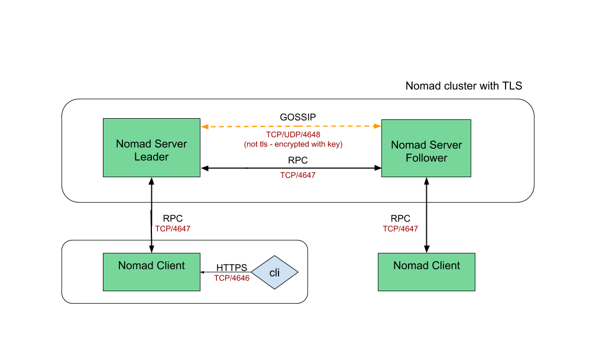

# Securing Nomad with mutual TLS (mTLS)

Securing Nomad's cluster communication is not only important for security but can even ease operations by preventing mistakes and misconfigurations. Nomad optionally uses mutual TLS (mTLS) for all HTTP and RPC communication. Nomad's use of mTLS provides the following properties:

- Prevent unauthorized Nomad access
- Prevent observing or tampering with Nomad communication
- Prevent client/server role or region misconfigurations
- Prevent other services from masquerading as Nomad agents



### Pre-requisites

- vagrant
- virtualbox
- git

## How to run

- Get the repo and bring up the environment

```
git clone https://github.com/achuchulev/vagrant-nomad-mtls.git
cd vagrant-nomad-mtls
vagrant up
```

- Run `vagrant up` that will spin up a virtualbox vm and execute scripts that:

```
./install/tools.sh # install required tools
./install/nomad.sh # install nomad
./instal/cfssl.sh # install CFSSL: Cloudflare's PKI and TLS toolkit

```

## How to secure Nomad with TLS

### ssh to virtualbox vm

```
vagrant ssh
```

### Create selfsigned certificates for Nomad cluster

The first step to configuring TLS for Nomad is generating certificates. In order to prevent unauthorized cluster access, Nomad requires all certificates be signed by the same Certificate Authority (CA). This should be a private CA and not a public one as any certificate signed by this CA will be allowed to communicate with the cluster.

```
Note!
      Nomad certificates may be signed by intermediate CAs as long as the root CA is the same. Append all intermediate CAs to the cert_file.
```

- Certificate Authority

This guide will use *cfssl* for CA to generate a private CA certificate and key:

```
$ # Generate the CA's private key and certificate
$ cfssl print-defaults csr | cfssl gencert -initca - | cfssljson -bare nomad-ca
```

The CA key (nomad-ca-key.pem) will be used to sign certificates for Nomad nodes and must be kept private. The CA certificate (nomad-ca.pem) contains the public key necessary to validate Nomad certificates and therefore must be distributed to every node that requires access.

- Node Certificates

Nomad certificates are signed with their region and role such as:

- *client.global.nomad* for a client node in the global region
- *server.us-west.nomad* for a server node in the us-west region

Create (or download) the following configuration file as cfssl.json to increase the default certificate expiration time:

```
{
  "signing": {
    "default": {
      "expiry": "87600h",
      "usages": [
        "signing",
        "key encipherment",
        "server auth",
        "client auth"
      ]
    }
  }
}
```

- Generate a certificate for the Nomad server, client and CLI

```
$ # Generate a certificate for the Nomad server
$ echo '{}' | cfssl gencert -ca=nomad-ca.pem -ca-key=nomad-ca-key.pem -config=cfssl.json \
    -hostname="server.global.nomad,localhost,127.0.0.1" - | cfssljson -bare server

# Generate a certificate for the Nomad client
$ echo '{}' | cfssl gencert -ca=nomad-ca.pem -ca-key=nomad-ca-key.pem -config=cfssl.json \
    -hostname="client.global.nomad,localhost,127.0.0.1" - | cfssljson -bare client

# Generate a certificate for the CLI
$ echo '{}' | cfssl gencert -ca=nomad-ca.pem -ca-key=nomad-ca-key.pem -profile=client \
    - | cfssljson -bare cli
```

Using localhost and 127.0.0.1 as subject alternate names (SANs) allows tools like curl to be able to communicate with Nomad's HTTP API when run on the same host. Other SANs may be added including a DNS resolvable hostname to allow remote HTTP requests from third party tools.

You should now have the following files:

| Filename | Description |
| ------------- | -----|
| cli.csr | Nomad CLI certificate signing request|
| cli.pem | Nomad CLI certificate|
| cli-key.pem | Nomad CLI private key|
| client.csr | Nomad client node certificate signing request for the global region|
| client.pem | Nomad client node public certificate for the global region|
| client-key.pem | Nomad client node private key for the global region|
| cfssl.json | cfssl configuration|
| nomad-ca.csr | CA signing request|
| nomad-ca.pem | CA public certificate|
| nomad-ca-key.pem | CA private key. Keep safe!|
| server.csr | Nomad server node certificate signing request for the global region|
| server.pem | Nomad server node public certificate for the global region|
| server-key.pem | Nomad server node private key for the global region|

Each Nomad node should have the appropriate key (-key.pem) and certificate (.pem) file for its region and role. In addition each node needs the CA's public certificate (nomad-ca.pem).

## How to configure and run Nomad with TLS

### Configure Nomad server

Nomad must be configured to use the newly-created key and certificates for (mutual) mTLS.

Create (or download) server1.hcl configuration file

```
# Increase log verbosity
log_level = "DEBUG"

# Setup data dir
data_dir = "/tmp/server1"

# Enable the server
server {
  enabled = true

  # Self-elect, should be 3 or 5 for production
  bootstrap_expect = 1
}

# Require TLS
tls {
  http = true
  rpc  = true

  ca_file   = "/path/to/nomad-ca.pem"
  cert_file = "/path/to/server.pem"
  key_file  = "/path/to/server-key.pem"

  verify_server_hostname = true
  verify_https_client    = true
}
```

```
Note!
      Enabling verify_https_client effectively protects Nomad from unauthorized network access at the cost of losing Consul HTTPS health checks for agents.
```

### Configure Nomad client

Create (or download) client1.hcl configuration file

```
# Increase log verbosity
log_level = "DEBUG"

# Setup data dir
data_dir = "/tmp/client1"

# Enable the client
client {
  enabled = true

  # For demo assume we are talking to server1. For production,
  # this should be like "nomad.service.consul:4647" and a system
  # like Consul used for service discovery.
  servers = ["127.0.0.1:4647"]
}

# Modify our port to avoid a collision with server1
ports {
  http = 5656
}

# Require TLS
tls {
  http = true
  rpc  = true

  ca_file   = "/path/to/nomad-ca.pem"
  cert_file = "/path/to/client.pem"
  key_file  = "/path/to/client-key.pem"

  verify_server_hostname = true
  verify_https_client    = true
}
```

## How to run Nomad with TLS

### Start Nomad server and client on the same machine

```
$ # In one terminal...
$ nomad agent -config /path/to/server1.hcl

$ # ...and in another
$ nomad agent -config /path/to/client1.hcl
```

## How to access nomad

### via CLI

Nomad CLI defaults to communicating via HTTP instead of HTTPS. 

To configure the local Nomad client to connect using TLS and specify your custom keys and certificates using the command line:

```
nomad node status -ca-cert=/path/to/nomad-ca.pem -client-cert=/path/to/cli.pem -client-key=/path/to/cli-key.pem -address=https://127.0.0.1:4646
```

As Nomad CLI also searches environment variables for default values, the process can be simplified exporting environment variables like shown below:

```
$ export NOMAD_ADDR=https://localhost:4646
$ export NOMAD_CACERT=/path/to/nomad-ca.pem
$ export NOMAD_CLIENT_CERT=/path/to/cli.pem
$ export NOMAD_CLIENT_KEY=/path/to/cli-key.pem
```

and then useing cli commands as usual will work fine.

for example:

```
nomad node status
```

### Server Gossip

At this point all of Nomad's RPC and HTTP communication is secured with mTLS. However, Nomad servers also communicate with a gossip protocol, Serf, that does not use TLS:

- *HTTP* - Used to communicate between CLI and Nomad agents. Secured by mTLS.
- *RPC* - Used to communicate between Nomad agents. Secured by mTLS.
- *Serf* - Used to communicate between Nomad servers. Secured by a shared key.

The Nomad CLI includes a _operator keygen_ command for generating a new secure gossip encryption key

```
$ nomad operator keygen
cg8StVXbQJ0gPvMd9o7yrg==
```

Put the same generated key into every server's configuration file server.hcl or command line arguments:

```
server {
  enabled = true

  # Self-elect, should be 3 or 5 for production
  bootstrap_expect = 1

  # Encrypt gossip communication
  encrypt = "cg8StVXbQJ0gPvMd9o7yrg=="
}
```
